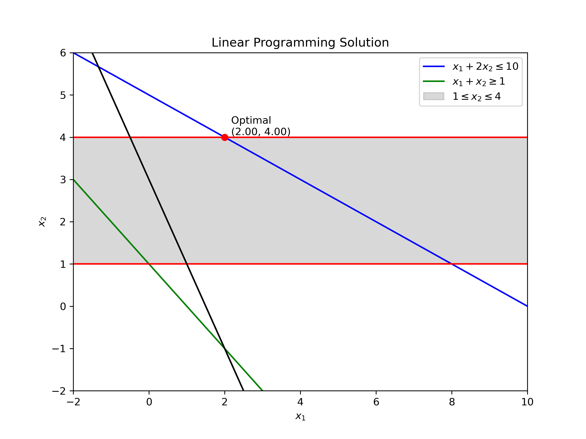

# Operational Research UWM

### Task 1 - Basic Problem

#### Linear Programming Problem Formulation

Objective function:

$$ \max Z = x_1 + 2x_2 $$

Subject to:
- $x_1 + 2x_2 \leq 10$
- $x_1 + x_2 \geq 1$
- $4 \geq x_2 \geq 1$ 
- $x_1, x_2 \geq 0$

Plotted solution:


> **Compared to exam:** I've achieved the same results.


### Task 2 - Transportation Problem
The problem objective is to minimize the total shipping cost to all customers from all sources. 

$$\mbox{minimize:}\quad \mbox{Cost} = \sum_{c \in Customers}\sum_{s \in Sources} T[c,s] x[c,s]$$

Shipments from all sources can not exceed the manufacturing capacity of the source.

$$\sum_{c \in Customers} x[c,s] \leq \mbox{Supply}[s] \qquad \forall s \in Sources$$

Shipments to each customer must satisfy their demand.

$$\sum_{s\in Sources} x[c,s] = \mbox{Demand}[c] \qquad \forall c \in Customers$$

```commandline
Total Shipping Costs =  670.0

Shipping Table:
Ship from  Supplier1  to  Customer3 : 10.0
Ship from  Supplier1  to  Customer4 : 70.0
Ship from  Supplier2  to  Customer2 : 60.0
Ship from  Supplier2  to  Customer3 : 40.0
Ship from  Supplier2  to  Fictional_Customer : 40.0
Ship from  Supplier3  to  Customer1 : 50.0
Ship from  Supplier3  to  Customer2 : 20.0
```

> **Compared to exam:** I've achieved the same results.

### Sources
* [Optimization @ UWM](https://uwmopt.github.io/) - webpage of the subject.
* [Operational Research Course](https://www.youtube.com/playlist?list=PLgA4wLGrqI-ll9OSJmR5nU4lV4_aNTgKx) a greate YouTube course by 
Yong Wang.
* [ND Pyomo Cookbook](https://jckantor.github.io/ND-Pyomo-Cookbook/README.html) a collection of notebooks showing the use Pyomo to solve modeling and optimization problems.
